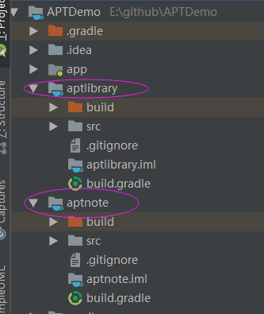
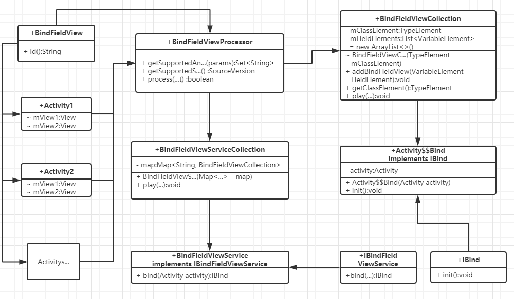
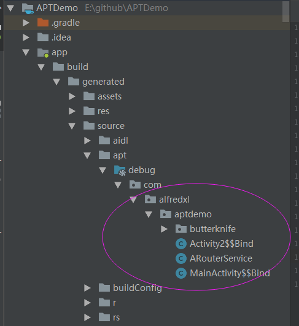

# APTDemo
这里主要介绍AOP编程之javapoet框架，javapoet框架也叫注解处理框架，必须依赖于注解；
## 一、准备工作：
#### 1、新建两个javaModule(可以先建两个正常的android Library项目)，一个用来存放注解，一个用来存放注解处理器，如下图:    
    
需要注意的是这里要把android Library改成java，所以要把两个Module的gradle配置文件改成如下配置:
```groovy
apply plugin: 'java'
dependencies {
    implementation fileTree(dir: 'libs', include: ['*.jar'])
}
```   
上面说到，这两个项目，一个用来存放注解和一些其它的类，一个用来存放处理注解的类，     
在处理注解类的Module中，需要在dependencies添加一下依赖，如下：
```groovy
dependencies {
    implementation fileTree(dir: 'libs', include: ['*.jar'])
    implementation project(':aptnote')
    implementation 'com.squareup:javapoet:1.9.0'
    implementation 'com.google.auto.service:auto-service:1.0-rc3'
}
```      
这里添加的依赖主要用来处理注解的，两个项目建好之后，准备工作就完成了；

## 一、开始创作艺术：    
这里将以两个示例来说明，看示例之前，你最好看一下[基本语法](https://www.aliyun.com/jiaocheng/13404.html)     

#### 1、这里先模仿一个很简单的Butterknife的实例：    
新建注解    
```java
@Retention(RetentionPolicy.CLASS)
@Target(ElementType.FIELD)
public @interface BindFieldView {
    int id();
}
```    
注解中有id属性，用来存放控件id，接下来创建注解处理类    
```java
@AutoService(Processor.class)
public class BindFieldViewProcessor extends AbstractProcessor {


    @Override
    public Set<String> getSupportedAnnotationTypes() {
        Set<String> types = new LinkedHashSet<>();
        // 添加了关注的注解
        types.add(BindFieldView.class.getCanonicalName());
        return types;
    }

    @Override
    public SourceVersion getSupportedSourceVersion() {
        return SourceVersion.latestSupported();
    }


    @Override
    public boolean process(Set<? extends TypeElement> set, RoundEnvironment roundEnvironment) {
        Map<String, BindFieldViewCollection> map = new HashMap<>();

        for (Element element : roundEnvironment.getElementsAnnotatedWith(BindFieldView.class)) {
            // 获取注解类所在的类元素
            TypeElement classElement = (TypeElement) element.getEnclosingElement();
            // 定义key
            String key = classElement.getQualifiedName().toString();
            if (!map.containsKey(key)) {
                map.put(key, new BindFieldViewCollection(classElement));
            }
            // 获取信息处理类
            BindFieldViewCollection mBindFieldViewCollection = map.get(key);
            // 添加被注解的成员变量元素
            mBindFieldViewCollection.addBindFieldView((VariableElement) element);
        }
        for (Map.Entry<String, BindFieldViewCollection> item : map.entrySet()) {
            // 按类处理注解
            item.getValue().play(processingEnv);
        }
        if (map.size() > 0) {
            // 添加统一管理类BindFieldViewService
            new BindFieldViewServiceCollection(map).play(processingEnv);
        }

        return true;
    }
}
```   
这里新建了一个类继承了AbstractProcessor类，主要就是添加了关注的注解，然后在process方法中就可以开始创作了;    

类图如下:



说一下简单原理：  
1、为每个Activity自动生成了一个以activity类名加上“$$Bind”结尾的类名的控件绑定类，创建该类的实例并调用init()方法就可以完成控件的赋值；    
2、把第一部分创建的所有的类，用一个管理类，管理起来；       
3、创建一个工具，调用管理类的bind()方法，既可以获取第一步创建的类，继而完成初始化      
4、在每个activity的onCreate()方法中调用BindFieldViewUtil.getInstance().bind(this)即可      
这里贴出类的创建关键代码： 
创建每一个activity的控件绑定类   
```java
public void play(ProcessingEnvironment processingEnvironment) {
        // 生成方法
        MethodSpec.Builder methodBuilder = MethodSpec.methodBuilder("init")
                .addAnnotation(Override.class)
                .addModifiers(Modifier.PUBLIC)
                .returns(TypeName.VOID);
        // 添加目标activity
        methodBuilder.addStatement("$T targetActivity = ($T)activity", mClassElement, mClassElement);
        for (VariableElement item : mFieldElements) {
            // 获取注解成员变量的注解
            BindFieldView mBindFieldView = item.getAnnotation(BindFieldView.class);
            // 获取控件ID
            int id = mBindFieldView.id();
            // 添加方法内容
            methodBuilder.addStatement("targetActivity.$N = targetActivity.findViewById($L)", item.getSimpleName(), id);
        }

        // 生成构造函数
        MethodSpec constructors = MethodSpec.constructorBuilder()
                .addModifiers(Modifier.PUBLIC)
                .addParameter(ClassName.get("android.app", "Activity"), "activity")
                .addStatement("this.$N = $N", "activity", "activity")
                .build();

        // 生成成员变量
        FieldSpec fieldSpec = FieldSpec.builder(ClassName.get("android.app", "Activity"), "activity")
                .addModifiers(Modifier.PRIVATE)
                .build();

        // 生成类
        TypeSpec finderClass = TypeSpec.classBuilder(mClassElement.getSimpleName() + "$$Bind")
                .addModifiers(Modifier.PUBLIC)
                .addSuperinterface(ClassName.get("com.alfredxl.aptdemo.butterknife", "IBind"))
                .addField(fieldSpec)
                .addMethod(constructors)
                .addMethod(methodBuilder.build())
                .build();
        try {
            JavaFile.builder(ElementUtils.getPackageName(mClassElement), finderClass).build().writeTo(processingEnvironment.getFiler());
        } catch (IOException e) {
            e.printStackTrace();
        }
    }
```       
创建统一管理类:    
```java
 public void play(ProcessingEnvironment processingEnvironment) {
        // 生成方法
        MethodSpec.Builder methodBuilder = MethodSpec.methodBuilder("bind")
                .addAnnotation(Override.class)
                .addModifiers(Modifier.PUBLIC)
                .returns(ClassName.get("com.alfredxl.aptdemo.butterknife", "IBind"))
                .addParameter(ClassName.get("android.app", "Activity"), "activity");
        // 生成方法体
        methodBuilder.addStatement("$T className = activity.getClass().getName()", String.class);
        // 方法体代码块
        CodeBlock.Builder caseBlock = CodeBlock.builder().beginControlFlow("switch (className)");
        for (Map.Entry<String, BindFieldViewCollection> item : map.entrySet()){
            // 注解所在的类
            TypeElement classTypeElement =item.getValue().getClassElement();
            caseBlock.add("case $S:\n", classTypeElement.getQualifiedName()).indent()
                    .addStatement("return new $T(activity)",
                            ClassName.get(ElementUtils.getPackageName(classTypeElement),
                                    classTypeElement.getSimpleName().toString() + "$$Bind")).unindent();
        }
        caseBlock.add("default:\n").indent().addStatement("return null").unindent();
        caseBlock.endControlFlow();
        methodBuilder.addCode(caseBlock.build());

        // 生成类
        TypeSpec finderClass = TypeSpec.classBuilder("BindFieldViewService")
                .addModifiers(Modifier.PUBLIC)
                .addSuperinterface(ClassName.get("com.alfredxl.aptdemo.butterknife", "IBindFieldViewService"))
                .addMethod(methodBuilder.build())
                .build();
        try {
            JavaFile.builder("com.alfredxl.aptdemo.butterknife", finderClass).build().writeTo(processingEnvironment.getFiler());
        } catch (IOException e) {
            e.printStackTrace();
        }
    }
```     
apt代码也算是比较容易写了，这里对语法部分就不多做讲解了，直接上生成的效果图:      


       


在这个目录下面生成的就是用apt自动生成的代码，其中以$$Bind结尾的就是上面说的每个Activity的控件绑定类;       
 
```java
public class MainActivity$$Bind implements IBind {
  private Activity activity;

  public MainActivity$$Bind(Activity activity) {
    this.activity = activity;
  }

  @Override
  public void init() {
    MainActivity targetActivity = (MainActivity)activity;
    targetActivity.mTextView = targetActivity.findViewById(2131165315);
    targetActivity.mImageView = targetActivity.findViewById(2131165247);
  }
}
```
 
上面就是自动生成的代码了。简单的butterknife注解框架就完成了，当然要想真正使用，这点是不够的，还需继续完善；    
      
#### 2、这里再模仿一个很简单的ARouter的实例：     
做过Android开发的都知道什么是模块化，随着APP越来越大，功能模块越来越多，也相对独立， 我们就需要独立模块出去了，   
以便于项目管理，这之中模块之间的activity相互调用，就是一个大问题了，但是运用APT技术，我们可以解决这个问题，     
ARouter框架也就由此而来，其实说到这个框架，原理也是很简单的，那么下面就来实际动手;     
同样先建立注解:    
```java
@Retention(RetentionPolicy.CLASS)
@Target(ElementType.TYPE)
public @interface ArouterPath {
    String path();
}
```     
这个注解是只能出现在类上的，所以我们要注意Target类型，注解中有path，用来对应相关activity, 接下来添加注解处理器:    
```java
 @Override
    public boolean process(Set<? extends TypeElement> set, RoundEnvironment roundEnvironment) {
        Set<? extends Element> mARouterSet = roundEnvironment.getElementsAnnotatedWith(ArouterPath.class);
        if (mARouterSet != null && mARouterSet.size() > 0) {
            ARouterCollection mARouterCollection = new ARouterCollection();
            for (Element element : mARouterSet) {
                if (element instanceof TypeElement) {
                    // 添加被注解的类元素
                    mARouterCollection.addTypeElement((TypeElement) element);
                }
            }
            try {
                mARouterCollection.play(processingEnv);
            } catch (ClassNotFoundException e) {
                System.out.println(e.getMessage());
                e.printStackTrace();
            }
        }
        return true;
    }
```     
这里贴出主要代码，说下原理；   
1、创建一个统一管理路径类，使用Map集合，管理path和Actvity的对应关系；     
2、工具类，调用管理类，根据Path既可查询到相关的Actvity，并启动它；     
接下来就是管理类的创建代码了：     
````java
public void play(ProcessingEnvironment processingEnvironment) throws ClassNotFoundException {
        // 生成方法
        MethodSpec method = MethodSpec.methodBuilder("getActivityClass")
                .addModifiers(Modifier.PUBLIC)
                .addAnnotation(Override.class)
                .addParameter(String.class, "path")
                .returns(Class.class)
                .addStatement("return map.get(path)")
                .build();

        // 生成构造函数
        MethodSpec.Builder constructors = MethodSpec.constructorBuilder()
                .addModifiers(Modifier.PUBLIC)
                .addStatement("map = new $T()", HashMap.class);
        for (TypeElement item : mClassElements) {
            // 获取注解成员变量的注解
            ArouterPath mArouterPath = item.getAnnotation(ArouterPath.class);
            // 获取控件ID
            String path = mArouterPath.path();
            // 添加方法内容
            constructors.addStatement("map.put($S, $T.class)", path, item);
        }

        // 生成成员变量
        FieldSpec fieldSpec = FieldSpec.builder(ParameterizedTypeName.get(
                ClassName.get(Map.class),
                ClassName.get(String.class),
                ClassName.get(Class.class)), "map")
                .addModifiers(Modifier.PRIVATE)
                .build();

        // 生成类
        TypeSpec finderClass = TypeSpec.classBuilder("ARouterService")
                .addModifiers(Modifier.PUBLIC)
                .addSuperinterface(ClassName.get("com.alfredxl.aptdemo.arouter", "IARouterService"))
                .addField(fieldSpec)
                .addMethod(constructors.build())
                .addMethod(method)
                .build();
        try {
            JavaFile.builder("com.alfredxl.aptdemo",
                    finderClass).build().writeTo(processingEnvironment.getFiler());
        } catch (IOException e) {
            e.printStackTrace();
        }
    }
````     
生成逻辑也是相当的简单，效果如下：    
  
```java
public class ARouterService implements IARouterService {
  private Map<String, Class> map;

  public ARouterService() {
    map = new HashMap();
    map.put("Activity2", Activity2.class);
  }

  @Override
  public Class getActivityClass(String path) {
    return map.get(path);
  }
}

```    


## 一、总结：     
总体来说，aptnote框架确实非常强大，特别是在代码书写这一块，比javassist要好用得多，不过apt也有它的缺陷，
它只能生成新的类，不能修改原有类（也是遵守了AOP，不对源码进行修改）；    
说到这里，如果想对源码进行修改，又不在我们的代码中留下痕迹，就只能修改编译后的class文件了，   
而这里，修改class文件，封装的还算好用的就是javassist了，有兴趣可以关注[javassist示例](https://github.com/alfredxl/PluginDemo)；    